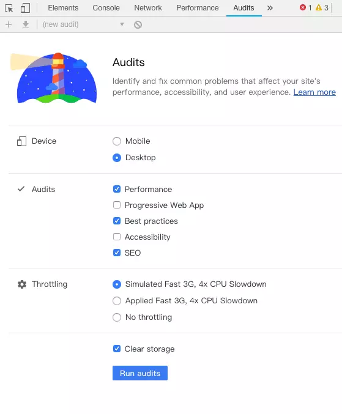
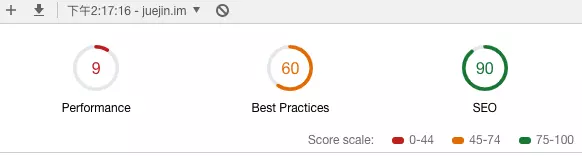
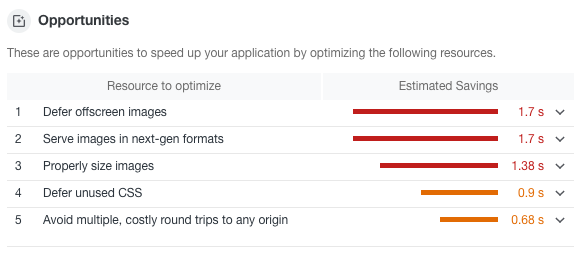
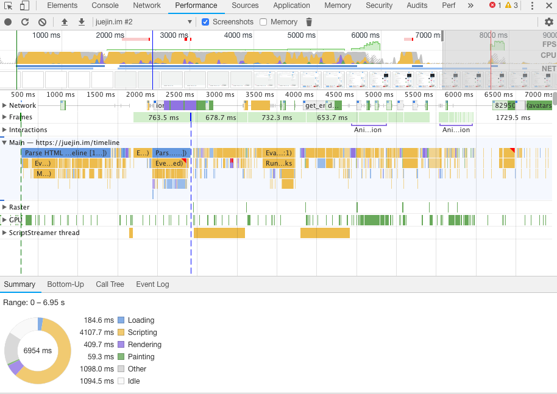

### 你会用什么工具来查找代码中的性能问题？

Profiler
google 调试工具
JSPerf
Dromaeo
还有比如 eslint 检查错误、react developer tools 查看组件

### 你会用什么方式来增强网站的页面滚动效能？

你应该是最外层用了 postion:absolute 的布局了，最外层要用 relative 的布局才不会这样，如果你实在要在最外层搞 absolute 得话那么你得在滚动的那一层上加 -webkit-overflow-scrolling: touch

### performance 检测页面性能

主要有 4 方面：（对照下图） 1.控制按钮。
2.overview。页面性能的高级汇总（FPS:帧率，CPU:CPU 占用，NET:网络请求） 3.火焰图。CPU 堆叠追踪的可视化（左侧名称是主线程的各种事件，Network:网络请求详细情况） 4.数据统计。以图表的形式汇总数据（summary:统计报表，Bottom-Up:事件时长顺序，Call Tree:事件调用顺序，Event log:事件发生的先后顺序）

HTML 文件为蓝色，脚本为黄色，样式表为紫色，媒体文件为绿色，其他资源为灰色

做录制：
打开想要查看的页面，刷新页面，打开 performance 面板，点击 Record 按钮（当前面板左上角），开始录制，recode 按钮变为红色，执行页面交互，再次点击 Record 停止录制。完成录制后，开发者工具会猜测哪一部分记录最相关，并自动缩放到那一部分

[详解](https://blog.csdn.net/kongduxue/article/details/82017491)

## 测试性能工具

Chrome 已经提供了一个大而全的性能测试工具 Audits。

选择想测试的功能然后点击 Run audits ，工具就会自动运行帮助我们测试问题并且给出一个完整的报告。

可以看到报告中分别为**性能、体验、SEO** 都给出了打分，并且每一个指标都有详细的评估。

评估结束后，工具还提供了一些建议便于我们提高这个指标的分数。

还有一个 Performance 工具也可以供我们使用。

在这张图中，我们可以详细的看到每个时间段中浏览器在处理什么事情，哪个过程最消耗时间，便于我们更加详细的了解性能瓶颈。

## 你都使用哪些工具来测试代码的性能？

Profiler, JSPerf（http://jsperf.com/nexttick-vs-setzerotimeout-vs-settimeout）, Dromaeo
