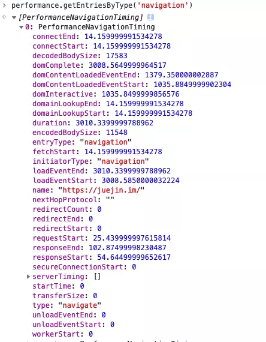
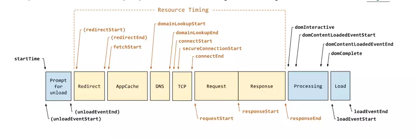

## 监控

### 前端错误的分类

- 资源加载错误
- 代码运行错误

### 错误的捕获方式

即时运行错误的捕获方式

- try - catch
- window.onerror

资源加载错误

- object.onerror
  - image 标签、script 标签上都可以加 onerror 事件
  - 资源加载错误不会冒泡，但会捕获
- performance.getEntries()
  - 获取所有已经加载资源的获取时长
- window 对象上通过事件捕获 Error 事件

注： addEventLitener('事件类型', function(e){ /_回调函数_/ },捕获 true 或冒泡 false )

一般情况下错误监控都是在捕获的阶段进行。

### 跨域的 JS 运行错误

因为了，只知道错误，但是无法定位错误信息
解决方法：

1. 客户端，在 script 标签上增加 crossorigin 属性
2. 服务端，设置 JS 资源响应头 `Access-Control-Allow-Origin: *`

### 上报错误信息

1. 采用 Ajax 通信上报
2. 利用 image 对象的 src 属性上报

### 为什么通常在发送数据埋点请求的时候使用的是 1x1 像素的透明 gif 图片

1. 能够完成整个 HTTP 请求+响应（尽管不需要响应内容）
2. 触发 GET 请求之后不需要获取和处理数据、服务器也不需要发送数据
3. 跨域友好
4. 执行过程无阻塞
5. 相比 XMLHttpRequest 对象发送 GET 请求，性能上更好
6. GIF 的最低合法体积最小（最小的 BMP 文件需要 74 个字节，PNG 需要 67 个字节，而合法的 GIF，只需要 43 个字节）

### 图片懒加载与预加载

图片懒加载的原理就是暂时不设置图片的 src 属性，而是将图片的 url 隐藏起来，比如先写在 data-src 里面，等某些事件触发的时候(比如滚动到底部，点击加载图片)再将图片真实的 url 放进 src 属性里面，从而实现图片的延迟加载

图片预加载，是指在一些需要展示大量图片的网站，实现图片的提前加载。从而提升用户体验。常用的方式有两种，一种是隐藏在 css 的 background 的 url 属性里面，一种是通过 javascript 的 Image 对象设置实例对象的 src 属性实现图片的预加载。相关代码如下：
css 实现

```css
#preload-01 {
  background: url(http://domain.tld/image-01.png) no-repeat -9999px -9999px;
}
#preload-02 {
  background: url(http://domain.tld/image-02.png) no-repeat -9999px -9999px;
}
#preload-03 {
  background: url(http://domain.tld/image-03.png) no-repeat -9999px -9999px;
}
```

Javascript 预加载图片的方式：

```js
function preloadImg(url) {
  var img = new Image();
  img.src = url;
  if (img.complete) {
    //接下来可以使用图片了
    //do something here
  } else {
    img.onload = function() {
      //接下来可以使用图片了
      //do something here
    };
  }
}
```

预加载：提前加载图片，当用户需要查看时可直接从本地缓存中渲染。
懒加载：懒加载的主要目的是作为服务器前端的优化，减少请求数或延迟请求数。
两种技术的本质：两者的行为是相反的，一个是提前加载，一个是迟缓甚至不加载。
懒加载对服务器前端有一定的缓解压力作用，预加载则会增加服务器前端压力

## 小册-监控

前端监控一般分为三种，分别为页面埋点、性能监控以及异常监控。

### 页面埋点

页面埋点应该是大家最常写的监控了，一般起码会监控以下几个数据：

- PV / UV
- 停留时长
- 流量来源
- 用户交互

对于这几类统计，一般的实现思路大致可以分为两种，分别为手写埋点和无埋点的方式。

相信第一种方式也是大家最常用的方式，可以自主选择需要监控的数据然后在相应的地方写入代码。这种方式的灵活性很大，但是唯一的缺点就是工作量较大，每个需要监控的地方都得插入代码。

另一种无埋点的方式基本不需要开发者手写埋点了，而是统计所有的事件并且定时上报。这种方式虽然没有前一种方式繁琐了，但是因为统计的是所有事件，所以还需要后期过滤出需要的数据。

### 性能监控

性能监控可以很好的帮助开发者了解在各种真实环境下，页面的性能情况是如何的。

对于性能监控来说，我们可以直接使用浏览器自带的 [Performance API](https://link.juejin.im/?target=https%3A%2F%2Fdeveloper.mozilla.org%2Fzh-CN%2Fdocs%2FWeb%2FAPI%2FPerformance) 来实现这个功能。

对于性能监控来说，其实我们只需要调用 `performance.getEntriesByType('navigation')` 这行代码就行了。对，你没看错，一行代码我们就可以获得页面中各种详细的性能相关信息。



我们可以发现这行代码返回了一个数组，内部包含了相当多的信息，从数据开始在网络中传输到页面加载完成都提供了相应的数据。



### 异常监控

对于异常监控来说，以下两种监控是必不可少的，分别是代码报错以及接口异常上报。

对于代码运行错误，通常的办法是使用 `window.onerror` 拦截报错。该方法能拦截到大部分的详细报错信息，但是也有例外

- 对于跨域的代码运行错误会显示 `Script error.` 对于这种情况我们需要给 `script` 标签添加 `crossorigin` 属性
- 对于某些浏览器可能不会显示调用栈信息，这种情况可以通过 `arguments.callee.caller` 来做栈递归

对于异步代码来说，可以使用 `catch` 的方式捕获错误。比如 `Promise` 可以直接使用 `catch` 函数，`async await` 可以使用 `try catch`。

但是要注意线上运行的代码都是压缩过的，需要在打包时生成 sourceMap 文件便于 debug。

对于捕获的错误需要上传给服务器，通常可以通过 `img` 标签的 `src` 发起一个请求。

另外接口异常就相对来说简单了，可以列举出出错的状态码。一旦出现此类的状态码就可以立即上报出错。接口异常上报可以让开发人员迅速知道有哪些接口出现了大面积的报错，以便迅速修复问题。
