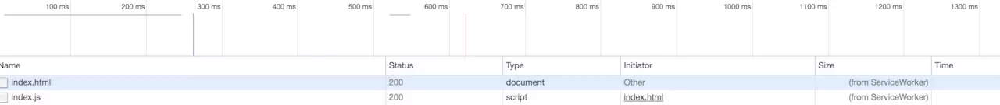
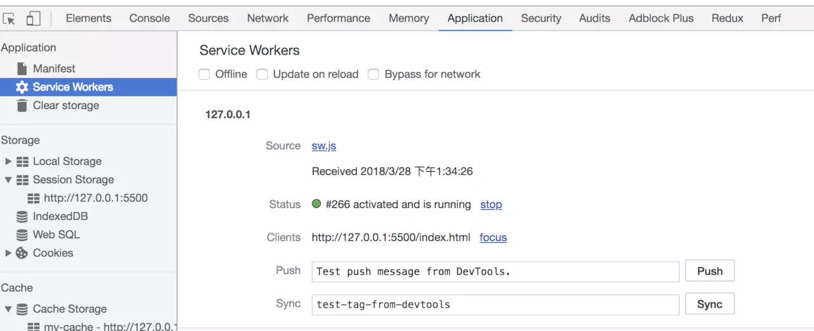
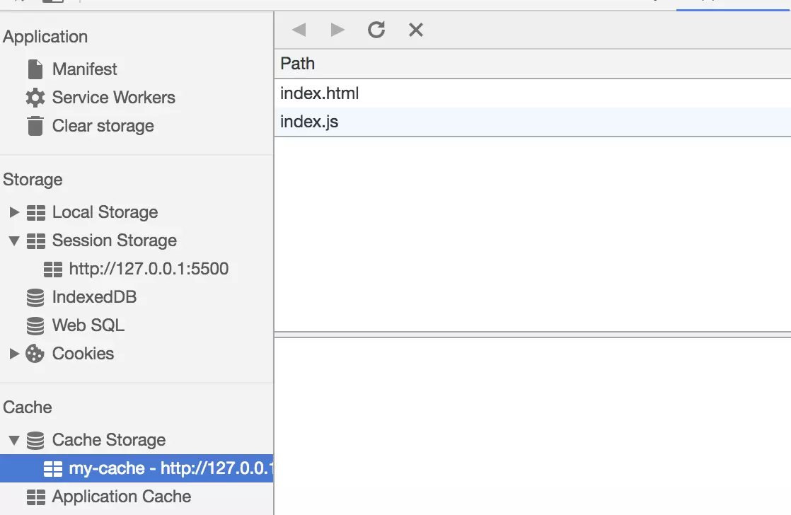
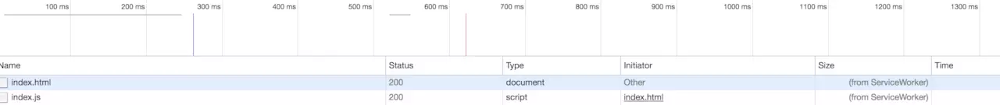

### ServiceWorker

https://www.cnblogs.com/cangqinglang/p/10776146.html

PWA 之所以能离线，是 Service Worker 的功劳。这并不是 W3C 第一次尝试让 Web 站点离线，在 Service Worker 之前，有个东西叫 Application Cache，<html manifest="cache.appcache">，是不是很熟悉?但是，由于 Application Cache 存 在很多无法容忍和无法解决的问题(可以查看这篇博客 Application Cache is a Douchebag)，它在 HTML5.1 版本中被移出了。

现在，我们终于有一个没有那么多问题的离线方案了，那就是 Service Worker。
Service Worker 是一个特殊的 Web Worker，独立于页面主线程运行，它能够 拦截和处理网络请求，并且配合 Cache Storage API，开发者可以自由的对页面发 送的 HTTP 请求进行管理，这就是为什么 Service Worker 能让 Web 站点离线的原因。

Service Worker 的工作方式也衍生出了几种不同的请求控制策略，network First,cache First,network Only,cache Only 和 fastest，对于不同类型的请求， 我们应该采取不同的策略，静态文件，我们可以选择 cache First 或者 fastest，甚 至 cache Only，对于依赖后端数据的 AJAX 请求，我们应该选择 network First 或者 network Only，保证数据的实时性。
Service Worker 从在浏览器注册到进入工作状态和最终销毁会经历不同的阶 段，下图比较清楚的画出了 Service Worker 的生命周期。
在整个生命周期中，Service Worker 会抛出不同的事件，如 install,active,fetch 等，可以通过 self.addEventListener 来监听。
比如，监听网络请求事件，这里我们采用的策略是 cache First。

```js
// service-worker.js
self.addEventListenr('fetch', e => {
  e.respondWith(
    caches.match(e.request).then(response => {
      return response || fetch(e.request);
    }),
  );
});
```

这里只是简单的介绍了一下 Service Worker，详细的使用文档可以参考怎么 使用 Service Worker。Service Worker 它并不只是能够缓存离线文件，后台同步和 Web Push 都是依 赖于 Service Worker 工作的，因此它的重要性不言而喻。

#### PushNotification

Push Notification 其实是两个 API 的结合，Notification API 和 Push API。
Notification API 提供了开发者可以给用户发送通知的能力，包括申请显示 通知权限，发起通知，以及定制通知的类型等等。Notification API 的历史比较 早，最早可以追溯到 2010 年，2011 年纳入标准，时至今日，Notication API 已经获 得了大多数平台的支持，包括 Chrome、Edge、Firefox、Safari 等的支持，比较可 惜的是，iOS Safari 至今还不支持。
Push API，则是让服务器能够向用户发送离线消息，即使用户当前并没有 打开你的页面，甚至没有打开浏览器。浏览器在接到消息推送时，会唤醒对应的 Service Worker，并抛出 push 事件，开发者接收到事件之后调用 Notification API 弹出通知，这就完成了整个接受和展示的流程。

```js
// service-worker.js
self.addEventListener('push', event => {
  event.waitUntil(
    // Process the event and display a notification.
    self.registration.showNotification('Hey!'),
  );
});
self.addEventListener('notificationclick', event => {
  // Do something with the event
  event.notification.close();
});
self.addEventListener('notificationclose', event => {
  // Do something with the event
});
```

在之前的分享和文章中，很少提及 Web Push，这并不是因为它不重要，而 是因为它在国内被支持程度非常低，支持 Web Push 的成本比 App Manifest 或者 Service Worker 要高的多，它需要浏览器厂商提供消息推送服务，截止到本文截 稿，国内只有 UC 即将发布的 U2 内核的浏览器才支持 Web Push API，Chrome 也因为其 依赖的 FCM/GCM 无法访问而导致 Web Push 无法使用。
浏览器接收到离线消息需要完成两个过程:

1. 浏览器订阅通知;
2. 服务器发送通知。 浏览器订阅通知，是指开发者调用 API 在消息服务器注册，具体过程如下图
   所示，通过服务器提供的 Public Key 从浏览器获取 Push Subscription 对象，Push Subcription 包含浏览器对应的消息服务器的地址和一些密钥认证数据，将它发送 到服务器，服务器将这些数据存储，发送离线消息需要使用到这些数据。订阅通知 的过程就完成了。
   服务器发送通知，服务器用 Private Key 将消息加密发送到之前保存的 Push Subcription 中对应的消息服务器，消息服务器解密消息后将消息推送到用户的浏 览器，浏览器唤醒 Service Worker，这就完成了整个消息推送的过程。

除了 Web App Manifest、Service Worker、Push API 这三个关键的技术 外，PWA 还包含很多优化的准则，比如 PRPL 模式，App Shell 模型，Credential Management API，等等。PWA 不是某一种特定的技术，换句话来说，PWA 是采用各种技术达到站点用户体验非常好的 Web App。单单从技术上讲，已经能够很好地弥补 传统 Web 的劣势了。

#### PWA 开发门槛也在降低

为了降低 PWA 的开发门槛，业界也推出了相应的工具。
例如，百度推出的 Lavas 就是一个开源的命令行工具，可以通过它来快速创建 PWA 项目。它提供了多种常用的 APP Shell 给用户选择，降低了开发成本，也简化了 工作流程，让 PWA 项目变得易于管理。

#### 各大站点纷纷实践，用 PWA 已成趋势?

PWA 刚推出时，就获得了很多大型站点的支持，比如印度最大的电商网站 Flipcart，它是第一个大规模应用 PWA 的站点，也取得了非常好的收益，用户停留 时长增长了 3 倍。除 Flipcart 之外，还有很多不错的案例。下面我们来看看国内外 的两个站点的实践案例。
案例 1:Twitter Lite PWA
首先，国外的 Twitter 在 2017 年上线了 Twitter Lite PWA，Google 开发者网站 上有 Twitter PWA 的案例分析。Twitter Lite PWA 同样收益惊人:
• 平均用户停留时长增长 65%;
• Web 站点发推的数量增长 75%(Amazing);
• 跳出率降低 20%。
Twitter Lite 能取得这样的成绩，归功于 PWA 的新技术和用户体验至上的设计
原则:它通过 Service Worker 缓存文件，让页面可以离线，同时降低网络消耗; 通过 Web Push 接受服务器推送的消息;采用 App Shell 的设计模型，配合 Service Worker 能让页面瞬间展现。
案例 2:ele.me PWA
Google 开发者网站上也对 ele.me 的案例进行了分析。从这个案例分析中，我 们可以看到 ele.me PWA 改造的收益如下:
• 预缓存的页面平均加载时间减少 11.6%;
• 所有页面的平均加载时间减少 6.35%;
• 在 3G 网络并且是第一次加载时，从页面加载到用户可操作的时间下降到
4.93s。
可见，ele.me 同样取得了很不错的收益。不同于 Twitter Lite，ele.me 是 MPA
站点，这会让站点变的更复杂，并且体验不如 SPA 那么顺畅，但是 ele.me 充分利用 了 PWA 的各种新技术和设计模式，将 MPA 的影响降到最小，比如使用了 PRPL 模式，最 大程度的降低页面的首屏时间，还采用了 App Skeleton 的设计方式让用户对正在加
48 2018，进击的大前端

载的页面内容有心里预期。 Twitter 和 ele.me 只是 PWA 站点中两个效果比较显著的案例，同样还有很多其
他的案例，可以访问 Google 的案例分析页面合集:https://developers.google. cn/web/showcase/
实际收益明显，再加上 Google 的强力支持，使得 PWA 的增长非常迅速，越来越 多的互联网大站跟进。下面这张图列出了一些站点，从最开始的 Flipcart，到目前 的 Instangram、Uber、Twitter、Starbucks 等，不仅数量在增加，站点等级和质量 也在不断地提升。放眼国内，百度、饿了么、阿里都已经有部分站点支持 PWA 了， 滴滴也表示有兴趣，可见，PWA 不仅在国外非常受重视，在国内同样受到各大互联 网企业的重视。

按照当前的发展趋势，PWA 将会带来 Web App 的大量需求，新一轮大前端技术 洗牌很可能近在眼前了。

### 请简要介绍一下 service worker？

### Service Worker

Service Worker 是运行在浏览器背后的**独立线程**，一般可以用来实现缓存功能。使用 Service Worker 的话，传输协议必须为 **HTTPS**。因为 Service Worker 中涉及到请求拦截，所以必须使用 HTTPS 协议来保障安全。

Service Worker 实现缓存功能一般分为三个步骤：首先需要先注册 Service Worker，然后监听到 `install` 事件以后就可以缓存需要的文件，那么在下次用户访问的时候就可以通过拦截请求的方式查询是否存在缓存，存在缓存的话就可以直接读取缓存文件，否则就去请求数据。以下是这个步骤的实现：

```js
// index.js
if (navigator.serviceWorker) {
  navigator.serviceWorker
    .register('sw.js')
    .then(function(registration) {
      console.log('service worker 注册成功');
    })
    .catch(function(err) {
      console.log('servcie worker 注册失败');
    });
}
// sw.js
// 监听 `install` 事件，回调中缓存所需文件
self.addEventListener('install', e => {
  e.waitUntil(
    caches.open('my-cache').then(function(cache) {
      return cache.addAll(['./index.html', './index.js']);
    }),
  );
});

// 拦截所有请求事件
// 如果缓存中已经有请求的数据就直接用缓存，否则去请求数据
self.addEventListener('fetch', e => {
  e.respondWith(
    caches.match(e.request).then(function(response) {
      if (response) {
        return response;
      }
      console.log('fetch source');
    }),
  );
});
```

打开页面，可以在开发者工具中的 `Application` 看到 Service Worker 已经启动了


在 Cache 中也可以发现我们所需的文件已被缓存


当我们重新刷新页面可以发现我们缓存的数据是从 Service Worker 中读取的



### serviceworker 如何保证离线缓存资源更新

Service workers 基本上充当应用同服务器之间的代理服务器，可以用于拦截请求，也就意味着可以在离线环境下响应请求，从而提供更好的离线体验。同时，它还可以接收服务器推送和后台同步 API
[详解](https://www.jianshu.com/p/b14d76eb594e)

#### Web Worker 和 webSocket

> worker 主线程:

1. 通过 worker = new Worker( url ) 加载一个 JS 文件来创建一个 worker，同时返回一个 worker 实例。
2. 通过 worker.postMessage( data ) 方法来向 worker 发送数据。
3. 绑定 worker.onmessage 方法来接收 worker 发送过来的数据。
4. 可以使用 worker.terminate() 来终止一个 worker 的执行。

`WebSocket`是`Web`应用程序的传输协议，它提供了双向的，按序到达的数据流。他是一个`HTML5`协议，`WebSocket`的连接是持久的，他通过在客户端和服务器之间保持双工连接，服务器的更新可以被及时推送给客户端，而不需要客户端以一定时间间隔去轮询。

### Service Worker

Service Worker 是运行在浏览器背后的独立线程，一般可以用来实现缓存功能。使用 Service Worker 的话，传输协议必须为 HTTPS。因为 Service Worker 中涉及到请求拦截，所以必须使用 HTTPS 协议来保障安全。

Service Worker 实现缓存功能一般分为三个步骤：首先需要先注册 Service Worker，然后监听到 install 事件以后就可以缓存需要的文件，那么在下次用户访问的时候就可以通过拦截请求的方式查询是否存在缓存，存在缓存的话就可以直接读取缓存文件，否则就去请求数据。以下是这个步骤的实现：

```js
// index.js
if (navigator.serviceWorker) {
  navigator.serviceWorker
    .register('sw.js')
    .then(function(registration) {
      console.log('service worker 注册成功');
    })
    .catch(function(err) {
      console.log('servcie worker 注册失败');
    });
}
// sw.js
// 监听 `install` 事件，回调中缓存所需文件
self.addEventListener('install', e => {
  e.waitUntil(
    caches.open('my-cache').then(function(cache) {
      return cache.addAll(['./index.html', './index.js']);
    }),
  );
});

// 拦截所有请求事件
// 如果缓存中已经有请求的数据就直接用缓存，否则去请求数据
self.addEventListener('fetch', e => {
  e.respondWith(
    caches.match(e.request).then(function(response) {
      if (response) {
        return response;
      }
      console.log('fetch source');
    }),
  );
});
```

打开页面，可以在开发者工具中的 Application 看到 Service Worker 已经启动了


在 Cache 中也可以发现我们所需的文件已被缓存


当我们重新刷新页面可以发现我们缓存的数据是从 Service Worker 中读取的


### Service Worker

> Service workers 本质上充当 Web 应用程序与浏览器之间的代理服务器，也可以在网络可用时作为浏览器和网络间的代理。它们旨在（除其他之外）使得能够创建有效的离线体验，拦截网络请求并基于网络是否可用以及更新的资源是否驻留在服务器上来采取适当的动作。他们还允许访问推送通知和后台同步 API

**目前该技术通常用来做缓存文件，提高首屏速度**

```js
// index.js
if (navigator.serviceWorker) {
  navigator.serviceWorker
    .register('sw.js')
    .then(function(registration) {
      console.log('service worker 注册成功');
    })
    .catch(function(err) {
      console.log('servcie worker 注册失败');
    });
}
// sw.js
// 监听 `install` 事件，回调中缓存所需文件
self.addEventListener('install', e => {
  e.waitUntil(
    caches.open('my-cache').then(function(cache) {
      return cache.addAll(['./index.html', './index.js']);
    }),
  );
});

// 拦截所有请求事件
// 如果缓存中已经有请求的数据就直接用缓存，否则去请求数据
self.addEventListener('fetch', e => {
  e.respondWith(
    caches.match(e.request).then(function(response) {
      if (response) {
        return response;
      }
      console.log('fetch source');
    }),
  );
});
```

> 打开页面，可以在开发者工具中的 Application 看到 Service Worker 已经启动了


> 在 Cache 中也可以发现我们所需的文件已被缓存


当我们重新刷新页面可以发现我们缓存的数据是从 Service Worker 中读取的

### Web Worker 和 webSocket

> worker 主线程:

1. 通过 worker = new Worker( url ) 加载一个 JS 文件来创建一个 worker，同时返回一个 worker 实例。
2. 通过 worker.postMessage( data ) 方法来向 worker 发送数据。
3. 绑定 worker.onmessage 方法来接收 worker 发送过来的数据。
4. 可以使用 worker.terminate() 来终止一个 worker 的执行。

`WebSocket`是`Web`应用程序的传输协议，它提供了双向的，按序到达的数据流。他是一个`HTML5`协议，`WebSocket`的连接是持久的，他通过在客户端和服务器之间保持双工连接，服务器的更新可以被及时推送给客户端，而不需要客户端以一定时间间隔去轮询。

### Web Worker

现代浏览器为 JavaScript 创造的 多线程环境。可以新建并将部分任务分配到 worker 线程并行运行，两个线程可 独立运行，互不干扰，可通过自带的 消息机制 相互通信
用法：

```js
const worker = new Worker('work.js');

// 向主进程推送消息
worker.postMessage('Hello World');

// 监听主进程来的消息
worker.onmessage = function(event) {
  console.log('Received message ' + event.data);
};
```

限制：
同源限制
无法使用 document / window / alert / confirm
无法加载本地资源

### 简述 webWorker

HTML5 则提出了 Web Worker 标准，表示 js 允许多线程，但是子线程完全受主线程控制并且不能操作 dom，只有主线程可以操作 dom，所以 js 本质上依然是单线程语言。
web worker 就是在 js 单线程执行的基础上开启一个子线程，进行程序处理，而不影响主线程的执行，当子线程执行完之后再回到主线程上，在这个过程中不影响主线程的执行。子线程与主线程之间提供了数据交互的接口 postMessage 和 onmessage，来进行数据发送和接收

```js
var worker = new Worker('./worker.js'); //创建一个子线程
worker.postMessage('Hello');
worker.onmessage = function(e) {
  console.log(e.data); //Hi
  worker.terminate(); //结束线程
};
//worker.js
onmessage = function(e) {
  console.log(e.data); //Hello
  postMessage('Hi'); //向主进程发送消息
};
```

### Web Worker 应用

- 处理密集型数学计算
- 大数据集排序
- 数据处理(压缩、音频分析、图像处理等)
- 高流量网络通信

### web worker 与多线程

现如今人们也意识到，单线程在保证了执行顺序的同时也限制了 javascript 的效率，因此开发出了 web worker 技术。这项技术号称让 javascript 成为一门多线程语言。

然而，使用 web worker 技术开的多线程有着诸多限制，例如：所有新线程都受主线程的完全控制，不能独立执行。这意味着这些“线程” 实际上应属于主线程的子线程。另外，这些子线程并没有执行 I/O 操作的权限，只能为主线程分担一些诸如计算等任务。所以严格来讲这些线程并没有完整的功能，也因此这项技术并非改变了 javascript 语言的单线程本质。

可以预见，未来的 javascript 也会一直是一门单线程的语言。

### 好文链接

- https://www.zcfy.cc/article/service-worker-what-are-you-mariko-kosaka-1927.html
- https://juejin.im/post/5ba0fe356fb9a05d2c43a25c
- https://juejin.im/post/5bf3f656e51d45338e084044
- https://juejin.im/post/5bf3f6b2e51d45360069e527
